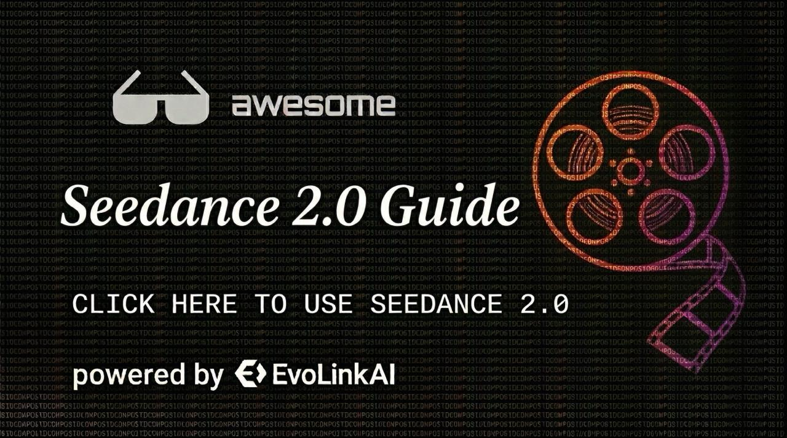

🌐 [English](README.md) | [简体中文](README.zh-CN.md) | **繁體中文** | [Español](README.es.md) | [日本語](README.ja.md) | [한국어](README.ko.md) | [Türkçe](README.tr.md) | [Français](README.fr.md) | [Deutsch](README.de.md)

---

# 🎬 Seedance 2.0 · 完全使用手冊

<p align="center">
  <a href="https://evolink.ai/seedance-2-0?utm_source=github&utm_medium=banner&utm_campaign=awesome-seedance-2-guide">
    
  </a>
</p>

<p align="center">
  <strong>Seedance 2.0<br>Human Face Now Available<br>Try Now</strong>
</p>

> **官方 Use Cases & Prompts 整理** | 多模態 AI 視頻生成實戰指南
>
> 🚀 **[evolink.ai](https://evolink.ai/signup?utm_source=github&utm_medium=readme&utm_campaign=awesome-seedance-2-guide)** 提供穩定的 Seedance 1、Seedance 1.5 及即將到來的 Seedance 2.0 服務

---


## ✨ 為什麼是 Seedance 2.0？

支持**圖像 + 視頻 + 音頻 + 文本**四種模態同時輸入，用 `@素材名` 自然語言描述你想要的效果，模型就能理解。不只是「生成」，更是真正可控的創作。

---

## 🎯 精選案例（基礎能力展示）

### Case 1 · 連續動作 — 曬衣服

**輸入：** 1張參考圖 + 文本

```
女孩在優雅的曬衣服，曬完接著在桶裡拿出另一件，用力抖一抖衣服。
```

| 輸入參考圖 | 生成結果（點擊播放） |
|:---:|:---:|
|  | [](https://pub-babc88c25d274cfeb8b2ae0cd0816872.r2.dev/assets/1/1-1/result.mp4) |

---

### Case 2 · 創意敘事 — 可樂廣告

**輸入：** 1張參考圖 + 文本

```
畫裡面的人物心虛的表情，眼睛左右看了看探出畫框，快速的將手伸出畫框拿起可樂喝了一口，
然後露出一臉滿足的表情，這時傳來腳步聲，畫中的人物趕緊將可樂放回原位，此時一位西部
牛仔拿起杯子裡的可樂走了，最後鏡頭前推畫面慢慢變得純黑背景只有頂光照耀的罐裝可樂，
畫面最下方出現藝術感字幕和旁白：「宜口可樂，不可不嚐！」
```

| 輸入參考圖 | 生成結果（點擊播放） |
|:---:|:---:|
|  | [](https://pub-babc88c25d274cfeb8b2ae0cd0816872.r2.dev/assets/1/1-2/result.mp4) |

---

### Case 3 · 複雜場景 — 19世紀倫敦

**輸入：** 1張參考圖 + 文本

```
鏡頭小幅度拉遠（露出街頭全景）並跟隨女主移動，風吹拂著女主的裙擺，女主走在19世紀的
倫敦大街上；女主走著走著右邊街道駛來一輛蒸汽機車，快速駛過女主身旁，風將女主的裙擺
吹起，女主一臉震驚的趕忙用雙手向下捂住裙擺；背景音效為走路聲，人群聲，汽車聲等等
```

| 輸入參考圖 | 生成結果（點擊播放） |
|:---:|:---:|
|  | [](https://pub-babc88c25d274cfeb8b2ae0cd0816872.r2.dev/assets/1/1-3/result.mp4) |

---

### Case 4 · 追逐動作 — 黑衣男逃亡

**輸入：** 1張參考圖 + 文本

```
鏡頭跟隨黑衣男子快速逃亡，後面一群人在追，鏡頭轉為側面跟拍，人物驚慌撞倒路邊的水果
攤爬起來繼續逃，人群慌亂的聲音。
```

| 輸入參考圖 | 生成結果（點擊播放） |
|:---:|:---:|
|  | [](https://pub-babc88c25d274cfeb8b2ae0cd0816872.r2.dev/assets/1/1-4/result.mp4) |

---

## 📋 參數規格

| 輸入類型 | 支持格式 | 數量上限 | 大小限制 | 時長限制 |
|----------|----------|----------|----------|----------|
| 圖片 | jpeg、png、webp、bmp、tiff、gif | ≤ 9 張 | 單張 < 30MB | — |
| 視頻 | mp4、mov | ≤ 3 個 | 單個 < 50MB | 總時長 2-15s |
| 音頻 | mp3、wav | ≤ 3 個 | 單個 < 15MB | 總時長 ≤ 15s |
| 文本 | 自然語言 | — | — | — |

**混合上限：** 總計 ≤ 12 個文件（圖 + 視頻 + 音頻合計）

**輸出規格：** 生成時長 4-15s 自由選擇，視頻最高 720p，自帶音效/配樂

> **合規說明：** 暫不支持上傳包含寫實真人臉部的素材。建議使用插畫風格、AI 生成的虛擬角色、動物、產品、場景等素材。

---

## 🎮 交互方式

用 `@素材名` 在 prompt 中指定每個素材的作用，上傳順序即編號順序：

```
@圖片1 作為首幀，@視頻1 參考鏡頭語言，@音頻1 用於配樂
```

| 入口 | 適用情況 |
|------|----------|
| **首尾幀** | 只上傳首幀圖（或首幀+尾幀）+ prompt |
| **全能參考** | 多模態組合輸入（圖 + 視頻 + 音頻 + 文本） |

**常用寫法：**

```
# 指定首幀
把@圖片1作為畫面的首幀圖，...

# 只參考運鏡不參考角色
參考@視頻1的所有運鏡效果，但角色使用@圖片1的形象

# 動作和運鏡分開參考
參考@視頻1的人物動作，參考@視頻2的環繞運鏡鏡頭語言

# 視頻延長（生成時長 = 新增秒數，不是總時長）
將@視頻1延長5s，[內容描述]

# 參考視頻音效
背景BGM參考@視頻1中的音效
```

---

## 💡 進階技巧

**Prompt 寫法**

- 長視頻（10s+）用時間軸分段：`0-3秒：[描述] / 3-6秒：[描述]`
- 動作/情緒要具體：❌ `人物很傷心` → ✅ `淚水沿臉頰滑落，嘴角微微顫抖`
- 一鏡到底必須在末尾加：`全程不要切鏡頭，一鏡到底。`

**關鍵詞觸發特定效果**

| 想要的效果 | 推薦寫法 |
|------------|----------|
| 希區柯克變焦 | `主角在驚恐時希區柯克變焦` |
| 環繞鏡頭 | `機械臂多角度環繞` |
| 速度漸快 | `過山車的速度越來越快` |
| 粒子特效 | `金色沙礫飄散` / `粒子吹散效果` |

**多模態組合策略**

| 你想控制的維度 | 用什麼素材 |
|----------------|------------|
| 角色外貌 | 圖片（多角度） |
| 運鏡方式 | 視頻（參考鏡頭語言） |
| 動作 | 視頻（參考動作） |
| 音色/語氣 | 視頻（含對話的參考視頻） |
| 背景音樂節奏 | 視頻或音頻 |
| 場景風格 | 圖片（場景參考圖） |

**常見問題**

- **參考視頻沒複刻運鏡？** → 加上 `完全參考@視頻1的所有運鏡效果`
- **角色長相不一致？** → 上傳多角度圖，prompt 加 `保持角色外貌與@圖片1完全一致`
- **視頻延長接縫不自然？** → 延長 prompt 開頭描述原視頻最後一幀的狀態

---

## 📝 Prompt 模板

**產品 360 展示**
```
@圖片1的[產品名]作為主體，運鏡參考@視頻1，推近到[特寫部位]的特寫，
鏡頭旋轉後[產品]反轉展示全貌，[產品特色細節]清晰可見，
周圍環境[氛圍描述]
```

**廣告對比**
```
這是一個[產品]廣告，@圖片1作為首幀畫面，[角色A]在[狀態A，如：優雅]，
鏡頭快速向右邊搖動，拍攝@圖片2[角色B][狀態B，如：狼狽]，
鏡頭向左邊搖動推進拍攝[產品]，[產品]參考@圖片3，[產品]在[工作狀態]。
```

**視頻延長腳本**
```
[N]s
將@視頻1[向前/向後]延長[N]秒。
[0-X]秒：[畫面描述]。
[X-Y]秒：[畫面描述]。
[Y-N]秒：[結尾畫面/字幕]。
```

**一鏡到底**
```
@圖片1@圖片2@圖片3...，[視角]一鏡到底的[運動方式]鏡頭，
[運動軌跡：從A經過B到達C]，[速度/節奏變化]。
全程不要切鏡頭，一鏡到底。
```

---

## 🗂 10大能力案例庫

| # | 能力 | Cases | 入口 |
|---|------|:-----:|------|
| 01 | 一致性全面提升 | 6 | [查看 →](./use-cases/zh-TW/01-consistency.md) |
| 02 | 運鏡和動作精準複刻 | 7 | [查看 →](./use-cases/zh-TW/02-camera-movement.md) |
| 03 | 創意模版/複雜特效複刻 | 8 | [查看 →](./use-cases/zh-TW/03-creative-effects.md) |
| 04 | 劇情補全能力 | 3 | [查看 →](./use-cases/zh-TW/04-story-completion.md) |
| 05 | 視頻延長 | 4 | [查看 →](./use-cases/zh-TW/05-video-extension.md) |
| 06 | 音色更準，聲音更真 | 10 | [查看 →](./use-cases/zh-TW/06-audio-voice.md) |
| 07 | 一鏡到底 | 5 | [查看 →](./use-cases/zh-TW/07-continuity.md) |
| 08 | 視頻編輯 | 5 | [查看 →](./use-cases/zh-TW/08-video-editing.md) |
| 09 | 音樂卡點 | 4 | [查看 →](./use-cases/zh-TW/09-music-sync.md) |
| 10 | 情緒演繹 | 3 | [查看 →](./use-cases/zh-TW/10-emotion.md) |

---

## 📁 倉庫結構

```
.
├── README.md              # 本文件（使用指南 + 精選案例 + 10大案例庫導航）
└── use-cases/             # 10大能力案例（含完整 prompt + 視頻）
    ├── 01-consistency.md
    ├── 02-camera-movement.md
    ├── 03-creative-effects.md
    ├── 04-story-completion.md
    ├── 05-video-extension.md
    ├── 06-audio-voice.md
    ├── 07-continuity.md
    ├── 08-video-editing.md
    ├── 09-music-sync.md
    └── 10-emotion.md
```

---

## 🤝 貢獻

歡迎提交新的案例和 Prompt 模板，直接提 PR 即可！

---

## 🚀 Seedance 2.0 Gateway Service 搶先體驗

透過 EvoLink 搶先體驗 Seedance 2.0 Gateway Service — 立即開始建構多模態 AI 影片應用。

<p align="center">
  <a href="https://Seedance2api.app"><strong>👉 申請搶先體驗 →</strong></a>
</p>

`jimeng` `seedance` `ai-video` `multimodal` `prompts` `video-generation` `bytedance`
